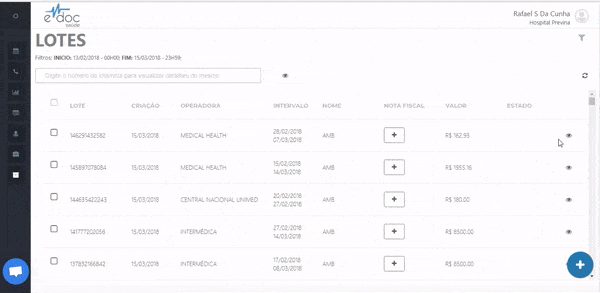

#  Imprimir capa de lote de faturamento

Para imprimir a capa de um lote, clique no botão de visualizar lote. Acesse o menu de opções e e clique em imprimir.

 
	  

	<ul>
		<li>Clique em visualizar lote</li>
		<li>Acesse o menu do lote e clique em Imprimir</li>
	</ul>

