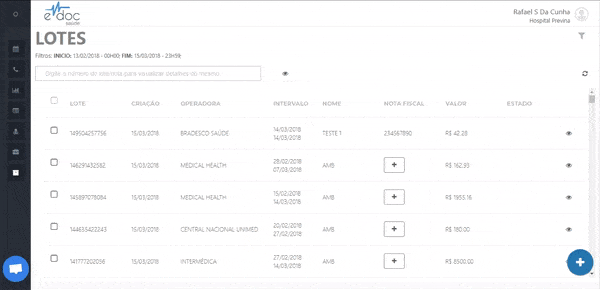

#  Excluir um lote de faturamento

Para encontrar um lote, clique no botão de visualizar lote. Acesse o menu de opções e e clique em excluir lote.

 
	  

	<ul>
		<li>Clique em visualizar lote</li>
		<li>Acesse o menu do lote e clique em Excluir</li>
		<li>Insira um motivo para exclusão e confirme</li>
	</ul>

