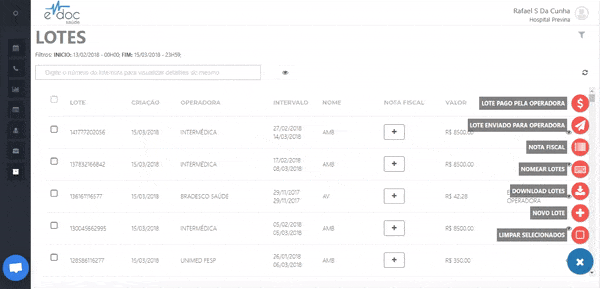

#  Gerar um lote de faturamento

A geração de lotes ocorre na página de **Lotes de guias** no menu lateral esquerdo.
Caso você não visualise essa página, solicite a permissão para o gestor de sua unidade.

Na página de lotes, clique na opção de novo lote. Selecione a unidade e o convênio para o qual se deseja emitir o lote de faturamento. Caso esteja na plataforma de atendimentos, nao será necessário selecionar a unidade.
Com as guias de agendamento em mãos, leia o código de barras (ou digite o número da guia) para inserí-las no lote.
Após finalizar, clique em salvar.

 
	  

	<ul>
		<li>Clique no botão de "Novo Lote" no menu de opções</li>
		<li>Selecione a unidade de atendimento e o convênio que deseja faturar. Se você já estiver na plataforma de atendimento, apenas a seleção do convênio será necessária</li>
		<li>Clique no campo de identificador da guia e efetue a leitura do código de barras</li>
		<li>Após finalizar a inserção das guias no lote, clique em finalizar para salvar</li>

	</ul>

