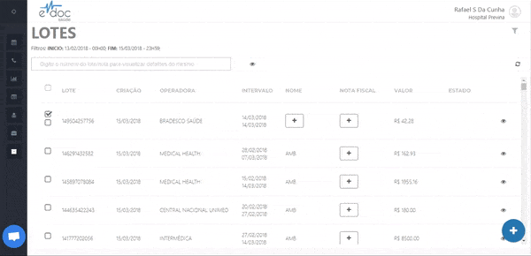
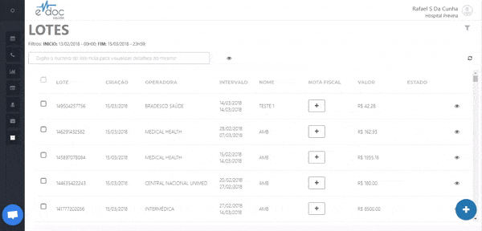

#  Renomear um lote

Para dar um nome para um lote (ou para um número qualquer de lotes), selecione o lote desejado na tela inicial, acesse os botões no menu e clique em nomear lotes.
Após inserir o nome desejado, os lotes selecionados serão referenciados por este nome.

 
	  

	<ul>
		<li>Selecione os lotes desejados</li>
		<li>Clique em nomear lotes</li>
		<li>Insira o nome desejado ao lote</li>
	</ul>

  

O mesmo é válido para associar um número de nota fiscal para um lote. Selecione os lotes desejado e, no menu de ações, clique em Nota Fiscal. Insira o número da nota fiscal desejada e finalize.

 
	  

	<ul>
		<li>Selecione os lotes desejados</li>
		<li>Clique em nota fiscal</li>
		<li>Insira o número da nota fiscal desejada</li>
	</ul>

