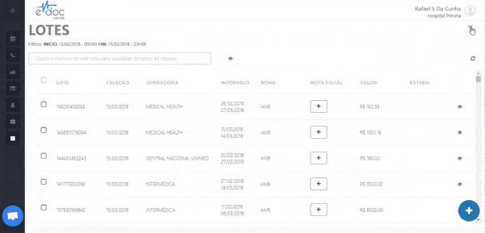
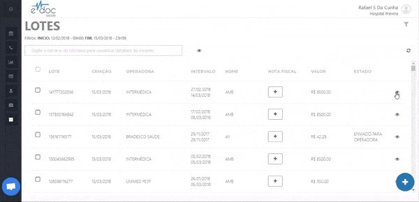

#  Encontrar e visualizar um lote de faturamento

Para encontrar um lote, clique no botão de filro no canto superior direito. É possível filtrar por convênios, nome do lote, número de nota fiscal ou data de início e fim dos atendimentos inseridos em um lote.

 
	  

	<ul>
		<li>Clique no filtro</li>
		<li>Selecione os parâmetros que deseja filtrar para encontrar um lote</li>
		<li>Clique em filtrar</li>
	</ul>

   
Para visualizar as guias inseridas em um lote, clique no botão de visualização a direita de cada lote criado.

 
	  

	<ul>
		<li>Encontre o lote na lista de lotes</li>
		<li>Clique no botão de visualizar para ver as guias em cada lote</li>
		<li>Adicione ou remova guias de um lote</li>
	</ul>

