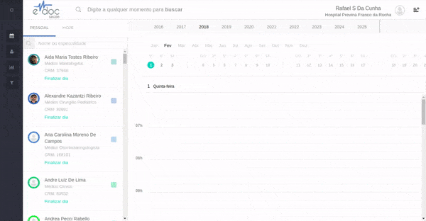
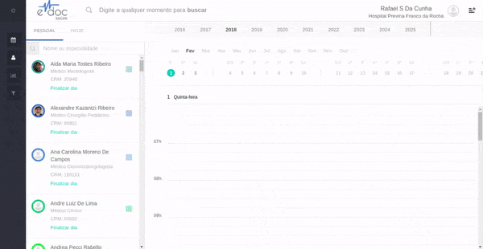

#  Buscar um paciente

Um paciente pode ser buscado na [busca global](#busca_global) ou na [página de pacientes](#pagina_pacientes).
Buscar por nome, CPF ou e-mail retornarão perfis de pacientes.

##1. Busca Global {#busca_global}

	

	<ul>
		<li>Selecione a busca global em qualquer tela</li>
		<li>Busque por nome, cpf ou e-mail</li>
		<li>Perfis de pacientes serão mostrados no lado direito da tela </li>
	</ul>

 

##2. Página de Pacientes {#pagina_pacientes}

	

	<ul>
		<li>Entre na página de pacientes</li>
		<li>Clique na barra de busca</li>
		<li>Busque por nome, cpf ou e-mail</li>
		<li>Selecione o perfil desejado na lista de resultados</li>
	</ul>

 

