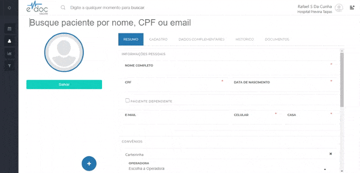

#  Histórico médico do paciente

Se seu usuário tiver a permissão de profissional de saúde, o perfil do paciente apresentará a aba de Documentos.

Nesta aba são mostrados, em ordem cronológica, todos os documentos médicos (prontuários, receituários, atestados, CIDs, etc) que foram emitidos ao longo da vida do paciente.

##1. Acessando o histórico médico do paciente

	

	<ul>
		<li>Selecione um paciente</li>
		<li>Clique na aba Documentos</li>
		<li>Clique sobre o documento que deseja visualizar</li>
	</ul>

 

