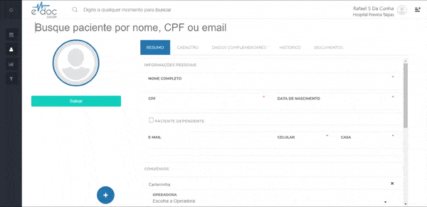

#  Editar um paciente

Após [buscar um paciente](busca.md), é possível editar os dados de cadastro do mesmo em seu perfil.
Para tanto, basta editar os dados nos formulátios de Resumo, Cadastro ou de Dados Complementares e clicar em salvar.

##1. Editar dados do paciente

	

	<ul>
		<li>Selecione um paciente</li>
		<li>Edite os dados de perfil</li>
		<li>Clique em Salvar</li>
	</ul>

 

