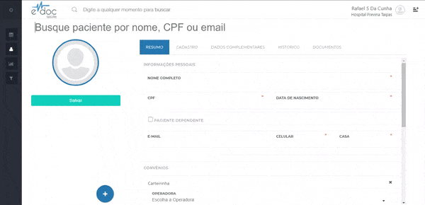
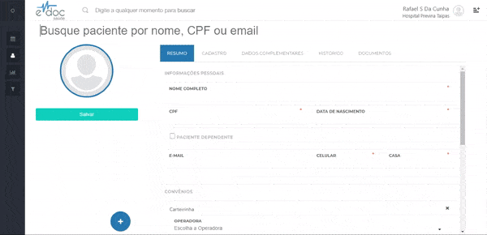

#  Histórico do paciente

Ao acessar a página de histórico no perfil do paciente é possível [visualizar todos os eventos](#visualizar_eventos) que foram agendados para este paciente, [visualizar detalhes](#visualizar_detalhes) sobre esse evento e [buscar eventos](#buscar_eventos) específicos do paciente.

##1. Histórico do paciente {#visualizar_eventos}

	

	<ul>
		<li>Selecione o perfil de um paciente</li>
		<li>Clique na aba de histórico</li>
		<li>Em cada evento é possível visualizar o profissional, especialidade, unidade de atendimento, data e status</li>
	</ul>

 

##2. Detalhes de um evento {#visualizar_detalhes}

	

	<ul>
		<li>Selecione o perfil de um paciente</li>
		<li>Clique na aba de histórico</li>
		<li>Em um evento, clique em "Ver Mais" para visualizar em ordem cronológica todos os usuários que interagiram com este evento</li>
	</ul>

##3. Buscar eventos {#buscar_eventos}

	

	<ul>
		<li>Selecione o perfil de um paciente</li>
		<li>Clique na aba de histórico</li>
		<li>Clique no botão de filtro no canto superior direito da tela</li>
		<li>Selecione as variáveis que dejesa e clique em filtrar</li>
	</ul>

